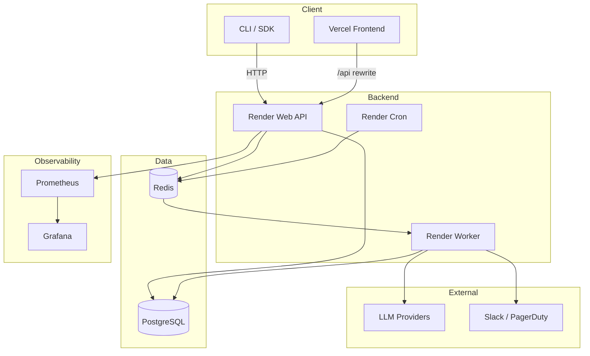

# DriftWatch

Continuous LLM evaluation and drift monitoring platform that detects quality regressions before they reach production.

[](https://github.com/YOUR_ORG/driftwatch/actions/workflows/ci.yml)
[](https://pypi.org/project/driftwatch/)
[](LICENSE)

## Features

- **Scheduled & on-demand evaluations** — run test suites on any LLM provider (OpenAI, Anthropic, Google, local models)
- **Drift detection** — statistical comparison across evaluation runs with configurable sensitivity
- **Multi-metric scoring** — accuracy, latency, cost, toxicity, faithfulness, and custom metrics
- **Alerting** — Slack, PagerDuty, and webhook notifications when drift exceeds thresholds
- **Dashboard** — real-time visualization of model performance over time
- **Python SDK & CLI** — define test suites in YAML/code, integrate into CI/CD
- **REST API** — trigger evaluations, query results, and manage configurations programmatically
- **Observability** — Prometheus metrics and Grafana dashboards out of the box

## Architecture



## Quick Start

### Install the CLI/SDK

```bash
pip install driftwatch
```

### Define a test suite

```yaml
# driftwatch.yml
name: gpt4-quality-suite
model: openai/gpt-4
schedule: "0 */6 * * *"

metrics:
  - accuracy
  - latency_p95
  - cost_per_token

thresholds:
  accuracy:
    min: 0.92
    drift_sensitivity: 0.05
  latency_p95:
    max: 2000

test_cases:
  - input: "Summarize this article about climate change."
    expected_behavior: "factual, concise, under 200 words"
  - input: "Translate 'Hello, how are you?' to French."
    expected_output: "Bonjour, comment allez-vous ?"
```

### Run an evaluation

```bash
driftwatch run --config driftwatch.yml
```

### Docker Compose (full stack)

```bash
git clone https://github.com/YOUR_ORG/driftwatch.git
cd driftwatch
# Create a root .env only if you want to override Docker Compose defaults.
docker compose up -d
```

The dashboard is at `http://localhost:3000`, the API at `http://localhost:8000/api/docs`.

## Web Evaluator Support

The current web executor supports these assertion types:

- `max_length`
- `min_length`
- `contains`
- `not_contains`
- `regex`
- `exact_match`
- `json_schema`
- `latency`
- `cost`

`semantic_similarity`, `llm_judge`, and `custom` are intentionally deferred for the web runtime in this milestone.

## Suite Editor Flow

- The web app now uses a dedicated suite editor at `/suites/new` and `/suites/:id/edit`.
- YAML remains the source of truth, but the editor validates drafts live, ships supported starter templates, and blocks unsupported web-runtime assertions before save.
- The top-level YAML `name` field is optional in the web editor. The suite name shown in the app comes from the separate Name field.

## Production Deployment

DriftWatch is set up to deploy the frontend on Vercel and the backend services on Render.

### Frontend (Vercel)

- Deploy the `frontend/` app from the `main` branch.
- Keep `VITE_API_URL=/api` so Vercel rewrites API requests to the Render backend.
- Leave `VITE_ENABLE_DEMO_AUTO_LOGIN=false` in production.
- Only set `VITE_DEMO_EMAIL`, `VITE_DEMO_PASSWORD`, and `VITE_DEMO_ORG` for demo environments where auto-login is intentionally enabled.

### Backend (Render)

- Deploy [render.yaml](render.yaml) from the `main` branch.
- For `driftwatch-api-free`, set the Render Root Directory / Docker build context to the repo root (`.`) and keep the Dockerfile path at `backend/Dockerfile`.
- Attach a shared Render environment group to the API, worker, and cron services and set `SECRET_KEY` there.
- Set `AUTO_CREATE_SCHEMA=false` and `ENABLE_INLINE_SCHEDULER=false` in production.
- Set `OPENAI_API_KEY` and/or `ANTHROPIC_API_KEY` on every service that executes runs.
- Set `LLM_MODEL_PRICING_JSON` if you want `cost` assertions and persisted cost estimates.
- Add `OPENAI_API_KEY`, `ANTHROPIC_API_KEY`, and `LLM_MODEL_PRICING_JSON` manually in Render when using Blueprint env vars marked `sync: false`.
- The API service runs an Alembic migration step before deploy; production schema changes should go through Alembic, not startup auto-creation.

### Production Verification

1. Confirm the GitHub CI workflow is green before merging to `main`.
2. Verify the Render API migration step succeeds during deploy.
3. Check `GET /api/health` after deploy.
4. Create or edit a suite from the guided editor and confirm unsupported assertions are blocked before save.
5. Trigger a manual run with `POST /api/suites/{suite_id}/run` and confirm it returns a `pending` run immediately.
6. Open `/runs/{run_id}` or the dashboard and confirm the page auto-refreshes until the run completes with real results.
7. Confirm scheduled suites produce a single run on the next Render cron tick.

## Tech Stack

| Layer         | Technology                       |
|---------------|----------------------------------|
| CLI / SDK     | Python 3.12, Click, httpx        |
| API           | FastAPI, SQLAlchemy, Pydantic    |
| Workers       | Celery, Redis                    |
| Database      | PostgreSQL 16                    |
| Frontend      | React 19, TypeScript, Vite       |
| Observability | Prometheus, Grafana              |
| Infra         | Docker Compose, Vercel, Render   |

## Project Structure

```
driftwatch/
├── driftwatch/              # Python CLI/SDK package
│   ├── __init__.py
│   ├── cli.py
│   ├── client.py
│   ├── config.py
│   └── models.py
├── backend/                 # FastAPI application
│   ├── app/
│   │   ├── main.py
│   │   ├── api/
│   │   ├── models/
│   │   ├── services/
│   │   └── ...
│   ├── worker/
│   ├── Dockerfile
│   └── requirements.txt
├── frontend/                # React TypeScript dashboard
│   ├── src/
│   ├── Dockerfile
│   ├── nginx.conf
│   └── package.json
├── infra/                   # Optional self-hosted infra and observability assets
│   ├── terraform/
│   ├── k8s/
│   ├── prometheus/
│   └── grafana/
├── tests/                   # Test suites
├── docs/                    # Documentation
├── .github/workflows/       # CI/CD pipelines
├── docker-compose.yml
├── render.yaml
├── frontend/vercel.json
└── README.md
```

## Development Setup

### Prerequisites

- Python 3.12+
- Node.js 22+
- Docker & Docker Compose
- PostgreSQL 16 (or use Docker)
- Redis 7 (or use Docker)

### Backend

```bash
python -m venv .venv
source .venv/bin/activate
pip install -r backend/requirements.txt
uvicorn app.main:app --app-dir backend --reload
```

### Frontend

```bash
cd frontend
npm install
npm run dev
```

### SDK

```bash
pip install -e "./driftwatch[dev]"
```

### Run everything with Docker

```bash
docker compose up -d
```

## API Documentation

When the API is running, interactive documentation is available at:

- **Swagger UI**: `http://localhost:8000/api/docs`
- **ReDoc**: `http://localhost:8000/api/redoc`

### Key endpoints

| Method | Path                      | Description                     |
|--------|---------------------------|---------------------------------|
| POST   | `/api/suites`             | Create a test suite             |
| POST   | `/api/suites/{suite_id}/run` | Trigger a new evaluation run |
| GET    | `/api/runs`               | List evaluation runs            |
| GET    | `/api/runs/{run_id}`      | Get evaluation details          |
| GET    | `/api/drift/{suite_id}`   | Get drift analysis for a suite  |
| POST   | `/api/webhooks/test`      | Send a test alert notification  |
| GET    | `/api/audit-log`          | List audit events               |
| GET    | `/api/health`             | Health check                    |
| GET    | `/api/metrics`            | Prometheus metrics              |

## Configuration

All configuration is via environment variables. See [backend/.env.example](backend/.env.example) and [frontend/.env.production](frontend/.env.production) for deployment defaults.

| Variable             | Description                    | Default              |
|----------------------|--------------------------------|----------------------|
| `DATABASE_URL`       | Async database connection string | Local SQLite file |
| `REDIS_URL`          | Redis connection string        | `redis://localhost:6379/0` |
| `SECRET_KEY`         | Shared JWT signing secret      | `change-me-in-production` |
| `AUTO_CREATE_SCHEMA` | Auto-run `create_all()` at startup | `true` |
| `ENABLE_INLINE_SCHEDULER` | Start APScheduler inside the API process | `true` |
| `ENABLE_INLINE_RUNS` | Run evaluations in-process via background tasks instead of Celery | `false` |
| `CORS_ORIGINS`       | Allowed CORS origins (JSON list) | `["http://localhost:3000","http://localhost:5173","https://driftwatch.vercel.app"]` |
| `VITE_API_URL`       | Frontend API base URL          | `/api`               |
| `VITE_ENABLE_DEMO_AUTO_LOGIN` | Enable demo-only login bootstrap | `false` in production |
| `OPENAI_API_KEY`     | OpenAI API key                 | —                    |
| `ANTHROPIC_API_KEY`  | Anthropic API key              | —                    |
| `LLM_MODEL_PRICING_JSON` | JSON pricing map shaped like `{"gpt-4o":{"input_per_million_tokens":1.0,"output_per_million_tokens":2.0}}` | `{}` |

## Contributing

## Contributing

1. Fork the repository
2. Create a feature branch: `git checkout -b feat/my-feature`
3. Make your changes and add tests
4. Run linting: `ruff check .` and `ruff format .`
5. Run tests: `pytest tests/ -v`
6. Commit with a descriptive message: `git commit -m "feat: add new metric type"`
7. Push and open a pull request

Please follow [Conventional Commits](https://www.conventionalcommits.org/) for commit messages.

## License

This project is licensed under the MIT License. See [LICENSE](LICENSE) for details.
